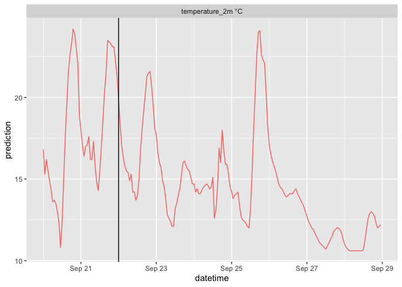
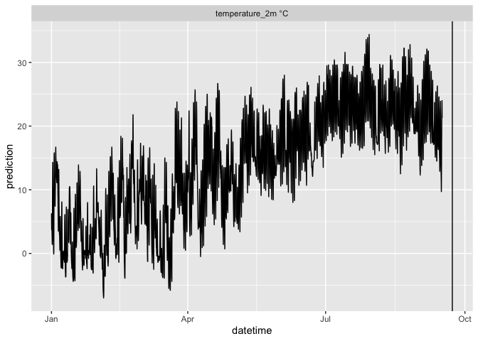
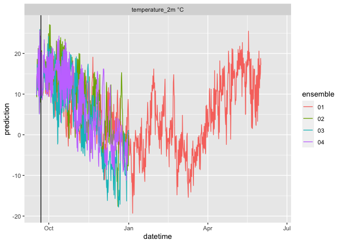
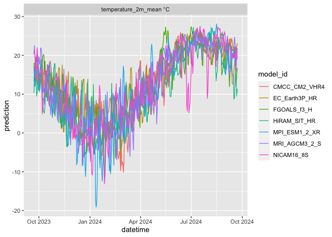

RopenMeteo
================

<!-- badges: start -->

[](https://github.com/FLARE-forecast/RopenMeteo/actions/workflows/R-CMD-check.yaml)
<!-- badges: end -->

R wrappers for APIs on Open-Meteo project. The Open-Meteo is a amazing
project that streamlines the access to a range of publically historical
and forecasted metereology data from agencies across the world. The free
access tier allows for 10,000 API calls per day. The paid tiers increase
the number of daily API calls (support for paid APIs in this package is
pending). Learn more about the Open-Meteo project at their website
(\[<https://open-meteo.com>\]) and consider supporting their efforts.

The package includes additional functionally to facilitate the use in
mechanistic environmental/ecological models. This includes the
calculation of longwave radiation (not provided through the API) from
air temperature and cloud cover, the writing of output to the format
required by the General Lake Model (GLM), and the conversion to the
standard used in the NEON Ecological Forecasting Challenge that is run
by the Ecological Initiative Research Coordination Network
(\[<https://neon4cast.org>\]). Future functionally includes the temporal
downscaling of the daily climate projection output and the 6-hourly
seasonal forecast to the hourly time step.

The package uses a long format standard with the following columns

    datetime = date and time of forecasted value
    reference_datetime = the date and time of the beginning of the forecast (horizon = 0). Does not apply to historical weather.
    model_id = id of model that generated the forecast
    ensemble = ensemble member number (only for ensemble weather and seasonal forecasts)
    variable = forecasted variable
    prediction = forecasted value
    unit = units of the variable

## Install

``` r
remotes::install_github("FLARE-forecast/RopenMeteo")
```

    ## 
    ## ── R CMD build ─────────────────────────────────────────────────────────────────
    ##      checking for file ‘/private/var/folders/ms/kf9vk0w17p18pvs8k_23t5y80000gq/T/Rtmpz6OvU1/remotesea4534fa21b9/FLARE-forecast-RopenMeteo-3dc1bac/DESCRIPTION’ ...  ✔  checking for file ‘/private/var/folders/ms/kf9vk0w17p18pvs8k_23t5y80000gq/T/Rtmpz6OvU1/remotesea4534fa21b9/FLARE-forecast-RopenMeteo-3dc1bac/DESCRIPTION’
    ##   ─  preparing ‘RopenMeteo’:
    ##      checking DESCRIPTION meta-information ...  ✔  checking DESCRIPTION meta-information
    ##   ─  checking for LF line-endings in source and make files and shell scripts
    ##   ─  checking for empty or unneeded directories
    ##   ─  building ‘RopenMeteo_0.0.0.9000.tar.gz’
    ##      
    ## 

``` r
library(tidyverse)
```

## Ensemble Weather Forecasts

\[<https://open-meteo.com/en/docs/ensemble-api>\]

``` r
df <- RopenMeteo::get_ensemble_forecast(
  latitude = 37.30,
  longitude = -79.83,
  forecast_days = 7,
  past_days = 2,
  model = "gfs_seamless",
  variables = c(
    "relativehumidity_2m",
    "precipitation",
    "windspeed_10m",
    "cloudcover",
    "temperature_2m",
    "shortwave_radiation"))
head(df)
```

    ## # A tibble: 6 × 7
    ##   datetime            prediction variable  ensemble model_id reference_datetime 
    ##   <dttm>                   <dbl> <chr>     <chr>    <chr>    <dttm>             
    ## 1 2023-09-20 00:00:00         65 relative… 00       gfs_sea… 2023-09-22 00:00:00
    ## 2 2023-09-20 00:00:00         64 relative… 01       gfs_sea… 2023-09-22 00:00:00
    ## 3 2023-09-20 00:00:00         66 relative… 02       gfs_sea… 2023-09-22 00:00:00
    ## 4 2023-09-20 00:00:00         65 relative… 03       gfs_sea… 2023-09-22 00:00:00
    ## 5 2023-09-20 00:00:00         69 relative… 04       gfs_sea… 2023-09-22 00:00:00
    ## 6 2023-09-20 00:00:00         62 relative… 05       gfs_sea… 2023-09-22 00:00:00
    ## # ℹ 1 more variable: unit <chr>

``` r
df |> 
  mutate(variable = paste(variable, unit)) |> 
  ggplot(aes(x = datetime, y = prediction, color = ensemble)) + 
  geom_line() + 
  geom_vline(aes(xintercept = reference_datetime)) + 
  facet_wrap(~variable, scale = "free")
```

<!-- -->

Options for models and variables are at
<https://open-meteo.com/en/docs/ensemble-api>

Note that `ecmwf_ifs04` does not include solar radiation.

List of global model ids:

    icon_seamless, icon_global, gfs_seamless, gfs025, gfs05, ecmwf_ifs04, gem_global

### Use with the General Lake Model

We have included functions that allow the output to be used with the
General Lake Model. Since the models do not include longwave, provide a
function to calculate it from the cloud cover and air temperature.

``` r
path <- tempdir()
df |> 
    RopenMeteo::add_longwave() |>
    RopenMeteo::write_glm_format(path = path)
  head(read.csv(list.files(path = path, full.names = TRUE, pattern = ".csv")[1]))
```

    ##               time AirTemp ShortWave LongWave RelHum WindSpeed Rain
    ## 1 2023-09-20 00:00    14.0        14   290.12     65      1.42    0
    ## 2 2023-09-20 01:00    12.6         0   282.09     69      1.28    0
    ## 3 2023-09-20 02:00    11.8         0   277.67     72      1.13    0
    ## 4 2023-09-20 03:00    11.2         0   274.43     74      1.14    0
    ## 5 2023-09-20 04:00    10.8         0   272.31     76      1.14    0
    ## 6 2023-09-20 05:00    10.6         0   271.26     78      1.14    0

### Converting to the same format in `neon4cast::stage2()`

\[<https://projects.ecoforecast.org/neon4cast-docs/Shared-Forecast-Drivers.html>\]

``` r
df |>
  RopenMeteo::add_longwave() |>
  RopenMeteo::convert_to_efi_standard()
```

    ## # A tibble: 46,872 × 6
    ##    model_id     datetime            parameter reference_datetime  variable      
    ##    <chr>        <dttm>              <chr>     <dttm>              <chr>         
    ##  1 gfs_seamless 2023-09-20 00:00:00 00        2023-09-22 00:00:00 relative_humi…
    ##  2 gfs_seamless 2023-09-20 00:00:00 00        2023-09-22 00:00:00 precipitation…
    ##  3 gfs_seamless 2023-09-20 00:00:00 00        2023-09-22 00:00:00 wind_speed    
    ##  4 gfs_seamless 2023-09-20 00:00:00 00        2023-09-22 00:00:00 cloudcover    
    ##  5 gfs_seamless 2023-09-20 00:00:00 00        2023-09-22 00:00:00 air_temperatu…
    ##  6 gfs_seamless 2023-09-20 00:00:00 00        2023-09-22 00:00:00 surface_downw…
    ##  7 gfs_seamless 2023-09-20 00:00:00 00        2023-09-22 00:00:00 longwave_radi…
    ##  8 gfs_seamless 2023-09-20 00:00:00 01        2023-09-22 00:00:00 relative_humi…
    ##  9 gfs_seamless 2023-09-20 00:00:00 01        2023-09-22 00:00:00 precipitation…
    ## 10 gfs_seamless 2023-09-20 00:00:00 01        2023-09-22 00:00:00 wind_speed    
    ## # ℹ 46,862 more rows
    ## # ℹ 1 more variable: prediction <dbl>

Note that `neon4cast::stage3()` is similar to

``` r
df |>
  RopenMeteo::add_longwave() |>
  RopenMeteo::convert_to_efi_standard() |> 
  filter(datetime < reference_datetime)
```

    ## # A tibble: 10,416 × 6
    ##    model_id     datetime            parameter reference_datetime  variable      
    ##    <chr>        <dttm>              <chr>     <dttm>              <chr>         
    ##  1 gfs_seamless 2023-09-20 00:00:00 00        2023-09-22 00:00:00 relative_humi…
    ##  2 gfs_seamless 2023-09-20 00:00:00 00        2023-09-22 00:00:00 precipitation…
    ##  3 gfs_seamless 2023-09-20 00:00:00 00        2023-09-22 00:00:00 wind_speed    
    ##  4 gfs_seamless 2023-09-20 00:00:00 00        2023-09-22 00:00:00 cloudcover    
    ##  5 gfs_seamless 2023-09-20 00:00:00 00        2023-09-22 00:00:00 air_temperatu…
    ##  6 gfs_seamless 2023-09-20 00:00:00 00        2023-09-22 00:00:00 surface_downw…
    ##  7 gfs_seamless 2023-09-20 00:00:00 00        2023-09-22 00:00:00 longwave_radi…
    ##  8 gfs_seamless 2023-09-20 00:00:00 01        2023-09-22 00:00:00 relative_humi…
    ##  9 gfs_seamless 2023-09-20 00:00:00 01        2023-09-22 00:00:00 precipitation…
    ## 10 gfs_seamless 2023-09-20 00:00:00 01        2023-09-22 00:00:00 wind_speed    
    ## # ℹ 10,406 more rows
    ## # ℹ 1 more variable: prediction <dbl>

With the only difference that the number of days is equal to the
`past_days` in the call to `RopenMeteo::get_ensemble_forecast()`. The
max past_days is ~60 days.

## Historical Weather

If you need more historical days for model calibration and testing,
historical data are available through open-meteo’s historical weather
API.

\[<https://open-meteo.com/en/docs/historical-weather-api>\]

``` r
df <- RopenMeteo::get_historical_weather(
  latitude = 37.30,
  longitude = -79.83,
  start_date = "2023-01-01",
  end_date = Sys.Date(),
  variables = c("temperature_2m"))
head(df)
```

    ## # A tibble: 6 × 5
    ##   datetime            variable       prediction model_id unit 
    ##   <dttm>              <chr>               <dbl> <chr>    <chr>
    ## 1 2023-01-01 00:00:00 temperature_2m        6.3 ERA5     °C   
    ## 2 2023-01-01 01:00:00 temperature_2m        5   ERA5     °C   
    ## 3 2023-01-01 02:00:00 temperature_2m        4   ERA5     °C   
    ## 4 2023-01-01 03:00:00 temperature_2m        3.7 ERA5     °C   
    ## 5 2023-01-01 04:00:00 temperature_2m        3.8 ERA5     °C   
    ## 6 2023-01-01 05:00:00 temperature_2m        3.9 ERA5     °C

``` r
df |> 
  mutate(variable = paste(variable, unit)) |> 
  ggplot(aes(x = datetime, y = prediction)) + 
  geom_line() + 
  geom_vline(aes(xintercept = lubridate::with_tz(Sys.time(), tzone = "UTC"))) + 
  facet_wrap(~variable, scale = "free")
```

    ## Warning: Removed 168 rows containing missing values (`geom_line()`).

<!-- -->

## Seasonal Forecasts

\[<https://open-meteo.com/en/docs/seasonal-forecast-api>\]

``` r
df <- RopenMeteo::get_seasonal_forecast(
  latitude = 37.30,
  longitude = -79.83,
  forecast_days = 274,
  past_days = 5,
  variables = c("temperature_2m"))
head(df)
```

    ## # A tibble: 6 × 7
    ##   datetime            prediction variable  ensemble model_id reference_datetime 
    ##   <dttm>                   <dbl> <chr>     <chr>    <chr>    <dttm>             
    ## 1 2023-09-17 00:00:00        9.5 temperat… 01       cfs      2023-09-22 00:00:00
    ## 2 2023-09-17 00:00:00        9.7 temperat… 02       cfs      2023-09-22 00:00:00
    ## 3 2023-09-17 00:00:00        9.7 temperat… 03       cfs      2023-09-22 00:00:00
    ## 4 2023-09-17 00:00:00        9.8 temperat… 04       cfs      2023-09-22 00:00:00
    ## 5 2023-09-17 06:00:00       14.4 temperat… 01       cfs      2023-09-22 00:00:00
    ## 6 2023-09-17 06:00:00        9.3 temperat… 02       cfs      2023-09-22 00:00:00
    ## # ℹ 1 more variable: unit <chr>

``` r
df |> 
  mutate(variable = paste(variable, unit)) |> 
  ggplot(aes(x = datetime, y = prediction, color = ensemble)) + 
  geom_line() + 
  geom_vline(aes(xintercept = reference_datetime)) +
  facet_wrap(~variable, scale = "free")
```

    ## Warning: Removed 2156 rows containing missing values (`geom_line()`).

<!-- -->

## Climate Projections

\[<https://open-meteo.com/en/docs/climate-api>\]

``` r
df <- RopenMeteo::get_climate_projections(
  latitude = 37.30,
  longitude = -79.83,
  start_date = Sys.Date(),
  end_date = Sys.Date() + lubridate::years(1),
  model = "EC_Earth3P_HR",
  variables = c("temperature_2m_mean"))
head(df)
```

    ## # A tibble: 6 × 5
    ##   datetime   variable            prediction model_id      unit 
    ##   <date>     <chr>                    <dbl> <chr>         <chr>
    ## 1 2023-09-22 temperature_2m_mean       13.3 EC_Earth3P_HR °C   
    ## 2 2023-09-23 temperature_2m_mean       14.6 EC_Earth3P_HR °C   
    ## 3 2023-09-24 temperature_2m_mean       18.1 EC_Earth3P_HR °C   
    ## 4 2023-09-25 temperature_2m_mean       15.4 EC_Earth3P_HR °C   
    ## 5 2023-09-26 temperature_2m_mean       16.2 EC_Earth3P_HR °C   
    ## 6 2023-09-27 temperature_2m_mean       14.5 EC_Earth3P_HR °C

### Multiple climate models

``` r
models <- c("CMCC_CM2_VHR4","FGOALS_f3_H","HiRAM_SIT_HR","MRI_AGCM3_2_S","EC_Earth3P_HR","MPI_ESM1_2_XR","NICAM16_8S")

df <- purrr::map_df(models, function(model){
  RopenMeteo::get_climate_projections(
    latitude = 37.30,
    longitude = -79.83,
    start_date = Sys.Date(),
    end_date = Sys.Date() + lubridate::years(1),
    model = model,
    variables = c("temperature_2m_mean"))
  })
```

``` r
df |> 
    mutate(variable = paste(variable, unit)) |> 
    ggplot(aes(x = datetime, y = prediction, color = model_id)) + 
    geom_line() +
    facet_wrap(~variable, scale = "free")
```

<!-- -->
